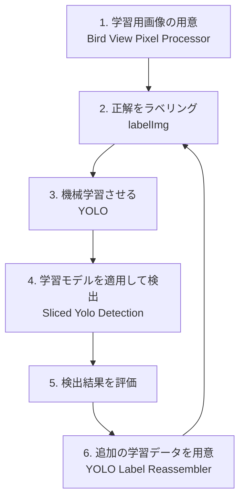

# Bird Detection Tools
鳥類の自動検出に関連して作った色んなツールをここで公開します。

<br><br>

# インストール方法
本プログラムをお使いの環境にCloneする。または個別の`*.py`ファイルを自分の環境にコピーするだけでも良いです。
```
git clone https://github.com/dante-12/bird-detection.git
```

次に、実行に必要なツールやライブラリをインストールする。

Ubuntuの場合(WSL/Ubuntuの場合も)
```
sudo apt install -y exiftool libxcb-cursor0 libvips
pip install pillow numpy exifread PyQt6 ultralytics sahi PySide6 pyvips
```

macOSの場合
```
brew install exiftool libvips
pip install pillow numpy exifread PyQt6 ultralytics sahi PySide6 pyvips
```

<br><br>

# ツール一覧
* <a href="bvpp/README.md">Bird View Pixel Processor</a>

    DJI社のドローンから地上を撮影した複数の画像を、GPS情報などに基づいて自動的に配置、拡大、縮小、回転を行ってモザイク合成を行うために、このスクリプトを作りました。コマンドラインからの実行で、合成から保存までの処理を一気に自動で完了させることを目的としています。多数の渡り鳥が写っている湖や沼の画像を合成するために作りました。

* <a href="sliced-yolo-detect/README.md">Sliced Yolo Detection</a>

    沼の写真をモザイク合成した巨大な画像からYOLOを使って鳥を検出するためのプログラムです。内部的には<a href="https://github.com/obss/sahi">SAHI</a>を使って画像を分割、YOLOで検出し、結果に基づいて、元の画像に様々な条件でラベリングを行います。

* <a href="yolo-label-reassembler/README.md">YOLO Label Reassembler</a>

    Sliced Yolo Detectで検出を行った画像とデータから、YOLOモデルの再学習に使うデータを取り出すためのプログラムです。単に巨大な画像を見るためのツールとしても使えます。

<br><br>

# 各ツールの使い所
機械学習モデルの改善には、次のサイクルを継続的に回す必要があります。それぞれのツールは、以下に記したステップで使用します。


<br><br>

# 謝辞
開発にあたって、画像の提供や評価、アドバイスなどをいただいた神山和夫様に感謝します。

<br><br>

# Contributing
不具合の報告や改善提案、Pull Request は歓迎します。

<br><br>

# ライセンス
MIT License
