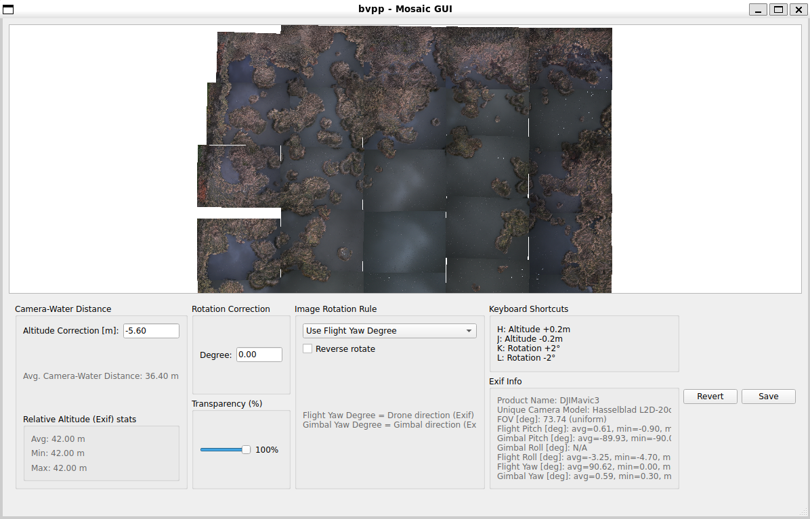

# bvpp: Bird View Pixel Processor
DJI社のドローンから地上を撮影した複数の画像を、GPS情報などに基づいて自動的に配置、拡大、縮小、回転を行ってモザイク合成を行うために、このスクリプトを作りました。コマンドラインからの実行で、合成から保存までの処理を一気に自動で完了させることを目的としています。多数の渡り鳥が写っている湖や沼の画像を合成するために作りました。

ほぼCLIだけで完結するスクリプトなので、インストールから実行まで5分程度で完了するはずです。以下、説明がやや長いですが、読みながら順番に実行していけばなんとかなります。



bvppという名称は、天体写真のモザイク合成に使われるAstro Pixel Processor(APP)にインスパイアされたものです。

<br>

# 仕様について
## 向いている用途
* モザイク合成に厳密な精度を求めない場合
* 個々の画像を別個に手動で拡大縮小・回転する必要がない場合

細かい調整が必要な場合はVirtical Photo PlacerやMicrosoft ICEを使った方が良いです。ジンバルが安定していなかったり、ドローンの高度が地上に近かったりすると、このスクリプトでは、なかなかうまく合成できないようです。

## 動作環境と制限
* Windows 11/WSL2/Ubuntu/Python 3.9.13でテストしました。OS依存性があるのは次の点だけだと認識しています。
* プログラム中でexiftoolという外部コマンドを呼び出しています。このためWindowsで直接（WSLを使わず）実行する場合は一工夫必要かも。Linux系、macOS系ならだいたい動くはず。
* メモリーを大量に消費します。実行中にKilledと出て終了した場合はほぼOut of memoryです。メモリーを増やしてください。
    * 作者の環境、RAM 32GBのWindows11/WSL2/Ubuntuでは、画素数が縦横35,000 x 38,000程度の画像を生成することができています。
    * --lake-altの数値を大きくするとメモリー不足に陥りやすいようです。

## モザイク合成に使用する元画像への必要要件
* DJIドローンで撮影されたものであること(Exiftの形式に対する要件)
* 撮影時にカメラが真下を向いていること(Gimbal Pitch Degreeが-90度前後であること) --inspect-onlyオプションで入力画像を検査できます。
* 撮影時にカメラがRoll（水平でなくなる）していないこと(Gimbal Roll Degreeが0かnullであること) --inspect-onlyオプションで入力画像を検査できます。
* 撮影対象の地面あるいは水面が平らであること

## 既知の問題
* GUIでズームすると解像度が極端に粗く見えますが、動作速度を安定させるための仕様です。Saveする際には元の解像度の画像を使います。
* GUIの動きが全体に緩慢です。キーボードを連打せず、何かキーを押したら画面が更新されるのを待ってください。
* 日本語のディレクトリ名やファイル名の扱いは未テスト
* --lake-altの数字を大きくするとメモリー不足に陥りがちです。
<br><br>

# インストール方法
<a href="../README.md">トップページ参照</a>。または`bvpp.py`ファイルを自分の環境にコピーするだけでも良いです。

<br>

# 使い方
1. 準備
    * モザイク合成したい画像を、まとめてどこかのフォルダに入れる。以下、仮に`./numa/`とする。合成に含めたくない画像はそのフォルダには入れないこと。
    * 撮影対象（地上・水面）の標高が何メートルか調べる。以下、仮に`-2.5m`とする。

2. 実行方法 - 簡略版 (<a href="docs/README-detail.md">詳細版はこちら</a>)

    ```
    $ cd bvpp
    $ python3 bvpp.py --in "./numa/" --out numa-00.jpg --lake-alt -2.5 --yaw-flight-only
    ```

    実行後、保存した画像（この例では`numa-00.jpg`）をチェックして意図通りの合成になっているか確認する。なっていればここで完了です。
    
    何かが大きくズレているなら、おそらく各画像の回転角度が誤っているか、拡大縮小率（--lake-altとExifのRelative Altitudeから逆算したカメラから被写体までの距離による）が誤っていると思われます。`--gui`オプションをつけて起動して、試行錯誤してみてください。キーボードからの操作で拡大縮小や回転が行えます。GUIの動きは遅いのでキーを押したら画面が更新されるまで待ち、連打はしないでください。
    ```
    $ python3 bvpp.py --in "./numa/" --out numa-00.jpg --lake-alt -2.5 --yaw-flight-only --gui
    ```

    GUI上で、あるべきパラメータが絞れたら、そのまま`Save`ボタンで保存しましょう。GUIに表示されているAltitudeやYaw offsetの数字を覚えておけば、次回以降はコマンドラインオプションからの指定で、GUIなしで保存することもできます。

<br>

# コマンドラインオプションの説明
最新の説明は`python bvpp.py -h`の出力を参照すること。

## 入力ファイルに関して
    * --in ディレクトリ名 : 合成したい画像を入れたディレクトリを指定
    * --inspect-only : 入力ファイルが意図したExifデータを含んでいるか、Roll/Pitchが想定範囲内か精査して、合成せずに終了

## 出力ファイルに関して
    * --out ファイル名 : 保存したい画像のファイル名を指定
    * --jpg-quality 95 : 保存するJPEGファイルの品質指定 1-95
    * --png-compress-level 6 : 保存するPNGファイルの品質指定 0-9

## ドローンの高度
    * --lake-alt 0 : ドローン空撮対象の標高 [m]。
    
    この値とExifのRelative Altitudeを足して、カメラから対象までの距離とみなす。マイナス値も可。Relative Altitudeの値は正確ではない場合があるので、このオプションで微調整する。GUIからも調整可能。

## ドローンとカメラの水平方向の向きの解釈方法
    * オプションをつけない場合はExifのFlight Yaw DegreeとGimbal Yaw Degreeを足した角度だけ画像を回転させる
    * --yaw-gimbal-only : Gimbal Yaw Degreeだけ画像を回転させる
    * --yaw-flight-only : Flight Yaw Degreeだけ画像を回転させる。推奨値。最初はこれを試してみてください。
    * --yaw-invert : Yaw Degreeは北方向から時計回りに数えるが、このオプションが指定されると反時計回りと見なす
    * --yaw-offset 角度 : 指定した角度だけ時計回りに画像を回転させる

## 入力画像のゆがみ補正（実験的実装）
    * --undistort : ゆがみ補正を行う
    * --k1 0.05 : ゆがみ補正用のパラメータ

## GUI
    * --gui : GUIつきで起動

<br>

# 補遺
<a href="docs/appendix-exif.md">スクリプトで使用しているExifパラメータ一覧</a>
