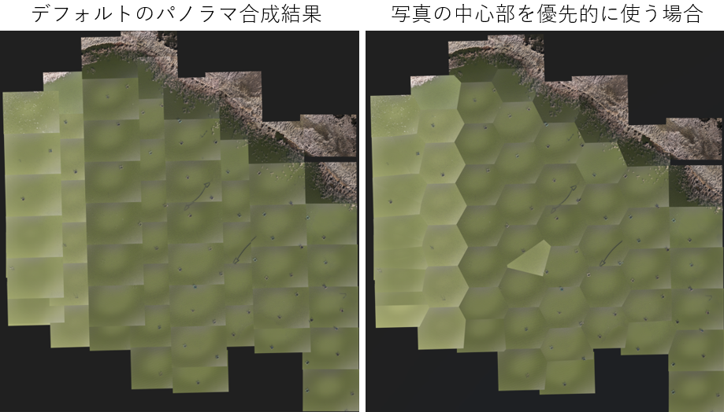

# bvpp: Bird View Pixel Processor
DJI社のドローンから地上を撮影した複数の画像を、GPS情報などに基づいて自動的に配置、拡大、縮小、回転を行ってモザイク合成を行うために、このスクリプトを作りました。コマンドラインからの実行で、合成から保存までの処理を一気に自動で完了させることを目的としています。多数の渡り鳥が写っている湖や沼の画像を合成するために作りました。

ほぼCLIだけで完結するスクリプトなので、インストールから実行まで5分程度で完了するはずです。以下、説明がやや長いですが、読みながら順番に実行していけばなんとかなります。


bvppという名称は、天体写真のモザイク合成に使われるAstro Pixel Processor(APP)にインスパイアされたものです。

<br>

# 仕様について
## 向いている用途
* モザイク合成に厳密な精度を求めない場合
* 個々の画像を別個に手動で拡大縮小・回転する必要がない場合

細かい調整が必要な場合はQGISの<a href="https://verticalphotoplacer.github.io/VerticalPhotoPlacer/">Vertical Photo Placer</a>やMicrosoft ICEを使った方が良いです。ジンバルが安定していなかったり、ドローンの高度が地上に近かったりすると、このスクリプトでは、なかなかうまく合成できないようです。

## 動作環境と制限
* Windows 11/WSL2/Ubuntu/Python 3.9.13でテストしました。Google Colabでも実行できます（GUIはColabでは動きません）。OS依存性があるのは以下の点だけだと認識しています。
* プログラム中でexiftoolという外部コマンドを呼び出しています。このためWindowsで直接（WSLを使わず）実行する場合は一工夫必要かも。Linux系、macOS系ならだいたい動くはず。
* メモリーを大量に消費します。実行中にKilledと出て終了した場合はほぼOut of memoryです。メモリーを増やすか、Google Colabのハイメモリ環境等で実行してください。メモリー消費量は、以下の「メモリー使用量の目安」を参照。
    * 作者の環境、RAM 32GBのWindows11/WSL2/Ubuntuでは、画素数が縦横35,000 x 38,000程度の画像をモザイク合成することができています。
    * --alt-correctionの数値を小さく（マイナス値）するとメモリー不足に陥りやすいようです。

## モザイク合成に使用する元画像への必要要件
* DJIドローンで撮影されたものであること(Exifの内容に対する要件)
* 撮影時にカメラが真下を向いていること(Gimbal Pitch Degreeが-90度前後でFlight Pitch Degreeが0度前後であること) --inspect-onlyオプションで入力画像を検査できます。
* 撮影時にカメラがRoll（水平でなくなる）していないこと(Gimbal Roll Degreeが0かnullであること) --inspect-onlyオプションで入力画像を検査できます。
* 撮影対象の地面あるいは水面が平らであること。

## 既知の問題
* GUIでズームすると解像度が極端に粗く見えますが、動作速度を安定させるための仕様です。Saveする際には元の解像度の画像を使います。GUIの解像度は`--preview-max-pix`オプションで変更できます。デフォルト値は2,048ピクセル。
* GUIの動きが全体に緩慢です。キーボードを連打せず、何かキーを押したら画面が更新されるのを待ってください。`--preview-max-pix 1024`などとすれば高速になるはず。
* 日本語のディレクトリ名やファイル名の扱いは未テスト
* --alt-correctionの数字を小さくするとメモリー不足に陥りがちです。
* GUIでSaveするとメモリー不足で保存に失敗する場合は、その際のAltitude CorrectionとRotation Correction値を覚えてから、一旦プログラムを終了し、CLIで（--guiオプションなしで）実行してみてください。その方がメモリー消費が少ないので保存に成功する可能性が高まります。

## メモリー使用量の目安
RAMが16GB程度のWSL2/Ubuntu環境の場合は、次の状況でした。仮想記憶容量を増やせばもっと大きな画像も扱えますが、動作は遅くなります。

**WSL2/Ubuntu メモリー16GBの場合**

|総ピクセル数|CLIのみでの動作|GUIからSaveした場合の動作|
|----|----|---|
|2,140 M pixel (61K x 35K pixel)|Saveできた|メモリー不足|
|7,380 M pixel (164K x 45K pixel)|メモリー不足|メモリー不足|

<br>

**Google Colab メモリー160GBの場合**

|総ピクセル数|使用メモリー|
|----|----|
|9,374 M pixel (109K x 86K pixel)|74GB|

<br><br>

# インストール方法
<a href="../README.md">トップページ参照</a>。または`bvpp.py`ファイルを自分の環境にコピーするだけでも良いです。

<br>

# 使い方
1. 準備
    * モザイク合成したい画像を、まとめてどこかのフォルダに入れる。以下、仮に`./numa/`とする。合成に含めたくない画像はそのフォルダには入れないこと。
    * ドローンのカメラと撮影対象（地上や水面）の間の最短距離が何メートルか調べ、その値と各画像Exifに記録されたRelative Altitude [m]値とのズレを算出する。実際には分からない場合が多いと思われるので、その場合は0とする。最短距離はQGISのVertical Photo Placer等で推定できる。例えば、Relative Altitudeが37.5mで、推定された距離が40.0mの場合は、`--alt-correction 2.5`とする。

2. 実行方法 - 簡略版 (<a href="docs/README-detail.md">詳細版はこちら</a>)

    ```
    $ cd bvpp
    $ python3 bvpp.py --in "./numa/" --out numa-00.jpg --alt-correction 2.5
    ```

    実行後、保存した画像（この例では`numa-00.jpg`）をチェックして意図通りの合成になっているか確認する。なっていればここで完了です。
    
    何かが大きくズレているなら、おそらく各画像の回転角度が誤っているか、拡大縮小率（--alt-correction [m]値とExifのRelative Altitude [m]から逆算したカメラから被写体までの距離による）が誤っていると思われます。`--gui`オプションをつけて起動して、試行錯誤してみてください。キーボードからの操作で拡大縮小や回転が行えます。GUIの動きは遅いのでキーを押したら画面が更新されるまで待ち、連打はしないでください。
    ```
    $ python3 bvpp.py --in "./numa/" --out numa-00.jpg --alt-correction 2.5 --gui
    ```

    GUI上で、あるべきパラメータが絞れたら、そのまま`Save`ボタンで保存しましょう。GUIに表示されているAltitude CorrectionやRotation Correctionの数字を覚えておけば、次回以降はコマンドラインオプションからの直接指定で、GUIなしで保存することもできます。

<br>

# コマンドラインオプションの説明
最新の説明は`python bvpp.py -h`の出力を参照すること。

## 入力ファイルに関して
    * --in ディレクトリ名 : 合成したい画像を入れたディレクトリを指定
    * --inspect-only : 入力ファイルが意図したExifデータを含んでいるか、Roll/Pitchが想定範囲内か精査して、合成せずに終了

## 出力ファイルに関して
    * --out ファイル名 : 保存したい画像のファイル名を指定。拡張子はpng推奨。JPEGは解像度の上限が厳しいので。
    * --jpg-quality 95 : 保存するJPEGファイルの品質指定 1-95
    * --png-compress-level 6 : 保存するPNGファイルの品質指定 0-9

## ドローンの高度のExif値に対する補正
    * --alt-correction 0 : Exif値のRelative Altitudeに記録されたドローンの飛翔高度への補正値 [m]。
    
    この値とExifのRelative Altitude（ドローンの出発点からの飛翔高度）を足して、カメラから対象までの距離とみなす。マイナス値も可。Relative Altitudeの値は正確ではない場合がありますし、出発地点の高度と湖面の高さが一致していない場合もあるので、このオプションで微調整する。QGIS Vertical Photo Placerを使えば推定できるが、分からない場合は0とし、GUIから調整すべし。

## ドローンとカメラの水平方向の向きの解釈方法
    * オプションをつけない場合はExifのFlight Yaw Degree（ドローン機体の水平方向の向きの値）とGimbal Yaw Degree（カメラの水平方向の向きの値）を足した角度だけ画像を回転させる
    * --yaw-flight-only : Flight Yaw Degreeだけ画像を回転させる。デフォルト値。最初はこれで試してください。
    * --yaw-gimbal-only : Gimbal Yaw Degreeだけ画像を回転させる
    * --yaw-both : Flight Yaw + Gimbal Yaw Degreeだけ画像を回転させる。
    * --yaw-invert : Yaw Degreeは北方向から時計回りに数えるが、このオプションが指定されると反時計回りと見なす
    * --yaw-offset 角度 : 指定した角度だけ時計回りに画像を回転させる

## GUI
    * --gui : GUIつきで起動

## GUIのプレビュー画像の解像度変更
    * --preview-max-pix : プレビュー画像の解像度を変更する。デフォルト値は2,048ピクセル。大きくすると画像は高精細になるがGUIの反応が遅くなりメモリーも沢山消費する。通常時はデフォルトで、高度を微調整したい場合に数字を大きくすると良いでしょう。

## 画像周辺部の解像力低下の軽減
    * --crop-optimize : レンズの収差などの影響で、画像の周辺部へ行くほど解像力が低下します。このオプションを指定すると、複数枚の画像が重なっている領域では、できるだけ各写真の中心寄りの画像を使うように調整します。この手法により解像力低下の影響を軽減できます。このオプションを使用するとプログラムの実行時間が10%ほど長くなり、メモリー消費量は二倍程度増えます。このオプションはディスクに保存されるファイルにだけ反映されます。ウィンドウ内に表示するプレビュー画像には反映されません。



## 入力画像のゆがみ補正（実験的実装）
    * --undistort : ゆがみ補正を行う
    * --k1 0.05 : ゆがみ補正用のパラメータ

<br>

# 補遺
<a href="docs/appendix-exif.md">スクリプトで使用しているExifパラメータ一覧</a>
