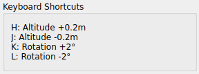
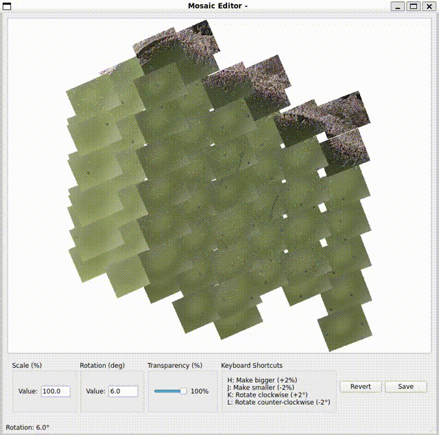
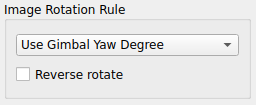
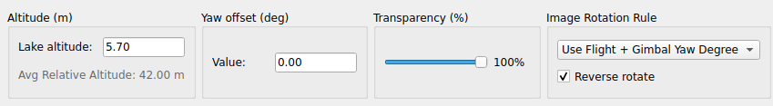

# 使い方の詳しい説明
1. 準備
    * モザイク合成したい画像を、まとめてどこかのフォルダに入れる。以下、仮に`./numa/`とする。　　
        合成したくない画像はそのフォルダには入れないこと。
    * ドローンのカメラと撮影対象（地上や水面）の間の最短距離が何メートルか調べ、その値と各画像Exifに記録されたRelative Altitude [m]値とのズレを算出する。実際には分からない場合が多いと思われるので、その場合は0とする。最短距離はQGISのVertical Photo Placer等で推定できる。例えば、Relative Altitudeが37.5mで、推定された距離が40.0mの場合は、`--alt-correction 2.5`とする。


2. 対象の画像に必要なExifのデータが含まれているか確認  
    次のコマンドを実行して、モザイク合成に使用する画像が意図したExif情報を持っているか、Gimbal Pitch/Rollの値が想定内か確認する。
    ```
    $ python3 bvpp.py --in "./numa/" --out numa-00.png --alt-correction 2.5 --inspect-only
    ```
    * `--in` 処理する画像ファイルの入ったディレクトリ名。必ず""でくくること。
    * `--out` モザイク合成した画像を保存する先。
    * `--alt-correction` 1で調べた高度の補正値。よく分からなければ0で良い。
    * `--inspect-only` 処理する画像ファイルのExif情報を精査して、その後何もせずプログラムを終了する

    次の出力例の通り全項目について`=OK`が出ていれば問題なし。rollのみOKではなく`=-`となるかも。それはそれでよし。お使いのドローンがDJI製ならここで問題が出ることはないはず。

    ```
    numa/DJI_0685.JPG: lat=OK lon=OK alt=OK yaw=OK pitch=OK roll=-- fov=OK keys={lat:['GPS Latitude', 'GPS Position'] lon:['GPS Longitude', 'GPS Position'] alt:['Relative Altitude', 'GPS GPSAltitude'] flight_yaw:['Flight Yaw Degree'] gimbal_yaw:['Gimbal Yaw Degree'] gimbal_pitch:['Gimbal Pitch Degree'] gimbal_roll:[] fov:['EXIF FocalLength', 'EXIF FocalLengthIn35mmFilm']}

    gimbal_pitch: -90.00 -89.90 -89.90 -90.00 -90.00 -89.90 -90.00 -90.00 -89.90 -90.00 -89.90 -89.90 -89.90 -90.00 -90.00 -89.90 -90.00 -90.00 -90.00 -90.00 -89.90 -89.90 -90.00 -89.90 -89.90 -89.90 -89.90 -90.00 -90.00 -90.00 -90.00 -90.00 -90.00 -90.00 -89.90 -90.00 -90.00 -89.90 -90.00 -89.90 -89.90 -90.00 -90.00 -89.90 -89.90 -90.00 -89.90 -89.90 -89.90 -89.90 -90.00 -89.90 -90.00 -90.00 -89.90 -90.00 -89.90 -90.00 -90.00 -90.00 -89.90 -90.00 -90.00 -89.90 -90.00

    gimbal_roll:  -- -- -- -- -- -- -- -- -- -- -- -- -- -- -- -- -- -- -- -- -- -- -- -- -- -- -- -- -- -- -- -- -- -- -- -- -- -- -- -- -- -- -- -- -- -- -- -- -- -- -- -- -- -- -- -- -- -- -- -- -- -- -- -- --
    ```

    OKが出ていれば次に進む。そうでない場合、それらのファイルは合成には使えません。

3. 最初の実行

    ```
    $ python3 bvpp.py --in "./numa/" --out numa-00.png --alt-correction 2.5
    ```

    実行後、この例では`numa-00.png`をチェックして意図通りの合成になっているか確認する。なっていればここで完了です。何かが大きくズレているなら、これ以降のステップに進む。

4. 最初の実行でうまくいかなかったらGUIを起動して試行錯誤を行う

    モザイク合成に一発で成功しなかった場合、考えられる原因は通常、次のいずれかです。
    * 画像の回転角度が誤っている（ドローンのカメラの向きが真北から何度ずれているかの算定（あるいはExifの情報）が誤っている）
    * 画像の拡大縮小率が間違っている（ドローンから地面・水面までの距離のExif値が誤っている）


    このような場合はGUIを起動して試行錯誤してみましょう。`--gui`オプションをつけて起動してください。
    ```
    $ python3 bvpp.py --in "./numa/" --out numa-00.png --alt-correction 2.5 --gui
    ```
    すると、新たなウィンドウが開かれてGUI画面表示されます。ウィンドウ内をマウスでドラッグしたりスクロールホイールを回すことで、画像を動かしたり、拡大縮小できます。

    画像のサイズや回転角が合わない場合は、キーボードから手動で変更できます。ウィンドウに書かれた次の表記の通り、四種類の操作が出来ます。

    

    キーを押した後、画面が更新されるまでにやや時間がかかることがあるので、連打しないでください。数秒待っても画面が更新されていない場合は、画像のどこかをクリックしてから、改めてキーを押してみてください。フォーカスが下のパネルに移動することがあり、その場合はキーボードからの操作が画像に反映されないことがあるのです。

    

    
    回転角度をExif値から調整するアルゴリズムを変更したい場合は、ウィンドウ下部にある以下のメニューを使います。デフォルトではFlight Yaw Degree（ドローンの水平方向の向きの値）の値だけに基づいて画像を回転させています。

    

    ここから色々組み合わせを選んでみて（全6通り）、意図した角度になる組み合わせを見つけてください。意味は次の通りです。DJIドローンの場合、たいていは"Use Flight Yaw Degree"（機体の水平方向の向きの値だけ使う）が正解だと思われますが、ドローンの設定によってはそうではない場合があるため、この機能を設けました。
    * Use Flight + Gimbal Yaw Degree [`--yaw-both`] - Flight Yaw（ドローンの水平方向の向き）とGimbal Yaw（カメラの水平方向の向き）を足した角度だけ回転させる
    * Use Gimbal Yaw Degree [`--yaw-gimbal-only`] - Gimbal Yaw（カメラの水平方向の向き）の角度だけ回転させる
    * Use Flight Yaw Degree [`--yaw-flight-only`]（規定値）- Flight Yaw（ドローンの水平方向の向き）の角度だけ回転させる
    * Reverse rotate - チェックすると上記の角度分だけ逆回転させる

5. プレビュー画像をもっと精細にしたい場合

    Preview画像は、高速化のため解像度を低くしてあります（一片の最大値2,048ピクセル）。もっと解像度を上げたい場合は、起動時のCLIで`--preview-max-pix 4096`等と指定すると、その分解像度が上がります。その数字を大きくしすぎると、GUIの拡大縮小回転が極端に遅くなるので注意してください。

6. 調整結果を保存する

    気に入ったところで`Save`ボタンを押して保存してください。ここでメモリー不足で強制終了してしまうことがありますが、その場合はメモリーを増やしていただくしかありません。現状では。

    GUIに表示されているAltitudeやRotation Correctionの数字を覚えておけば、次回以降はコマンドラインオプションからのそれらの値を直接指定し、GUIなしで保存まで行うことができるので便利です。

    

    上記の例だと`python bvpp.py .... --alt-correciton -5.7 --yaw-offset -10 --yaw-gimbal-only --yaw-invert`となります。Camera-Water Distance枠に書かれている"Relative Altitude (Exif) stats"というのは、全ての画像のRelative Altitude値の平均・最小・最大値 [m]で、ドローンが認識している飛翔開始地点からの高度です。