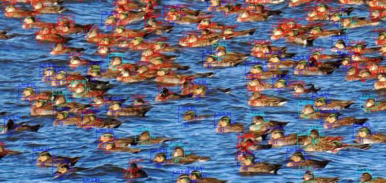
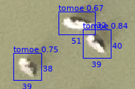
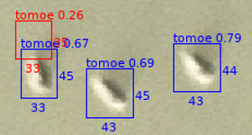
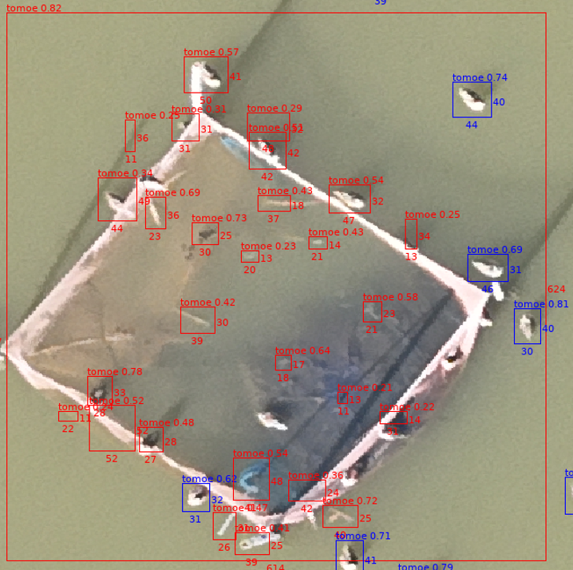
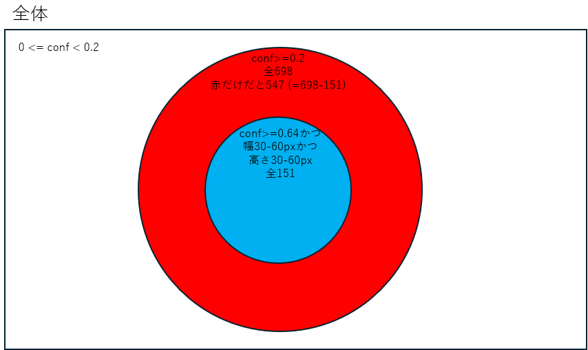

# Sliced Yolo Detect
沼や湖を撮影した超高解像度画像に<a href="https://docs.ultralytics.com/ja/">YOLO</a>で生成した学習モデルを適用して、渡り鳥の姿を検出するために作成したプログラムです。YOLOの学習モデルは別途用意していただく必要があります。



<br>

# 特徴

* メモリの許す限り巨大な画像を扱える・・はず。35K x 38K ピクセルの画像でテストしたところ30GBの空きメモリが必要でしたが、動作しました。画像処理にはPillowというライブラリを使っており、またこのスクリプトから呼び出している<a href="https://github.com/obss/sahi">SAHI</a>のライブラリ内でもPillowを使っているため、究極的にはPillowの制限次第となります。メモリー消費量の詳しい情報は、以下の「メモリー使用量の目安」セクションを参照してください。
* 検出には<a href="https://github.com/obss/sahi">SAHI</a>経由で<a href="https://docs.ultralytics.com/ja/">YOLO</a>を使っています
* ラベリングを行った画像に対して、検出したオブジェクトのサイズを表示できるほか、正解と見なすオブジェクト（各画像）のサイズを範囲指定できます。こうすることで大きすぎる、あるいは小さすぎる画像の誤検知を排除できます。<br>
    
* 検出時のConfidenceの下限値指定（YOLO detectに対する指定）の他に、正解のカウント用に使うConfidence値の下限も別途指定できます。この機能を使ってカウントに適切なConfidence値を絞り込めます。例えばYOLOでの検出は0.2(20%)以上にするけど、そのうち正解は0.8(80%)以上とするなど。
* 検出したオブジェクトのサイズについて、ヒストグラム表示できます。これで外れ値となるサイズを把握しやすくなります。以下の例では20以下は外れ値のようですね。
  ```
    width histogram (10px bins):
       0-10  :     23
      10-20  :    200 **
      20-30  :    164 *
      30-40  :   1669 *************
      40-50  :   5228 ****************************************
      50-60  :    770 ******
      60-70  :      7
      70-80  :      1
  ```


<br>

## 動作環境と制限
* Windows 11/WSL2/Ubuntu/Python 3.9.13で開発・テストしました。このスクリプト自体の環境依存性は低いはず。Ultralyticsライブラリ次第でしょう。
* Google ColabのA100 GPUでも動作確認済み。
* メモリーを大量に消費します。実行中にKilledと出て終了した場合はほぼOut of memoryです。メモリーを増やしてください。詳しくは以下の「メモリー使用量の目安」セクションを参照。
    * 作者の環境、RAM 32GBのWindows11/WSL2/Ubuntuでは、画素数が縦横32,000 x 17,000程度の画像を処理することができています。
* 学習済みモデル（.ptファイル）は別途用意してください。Ultralytics社が<a href="https://huggingface.co/Ultralytics/YOLO11">公開</a>しているyolo11n.ptなどもダウンロードすればそのまま使えます。
* YOLOでの検出に使用するclassの指定は出来ません。学習モデルに含まれる全てのclassが検出対象となります。

<br>

## 既知の問題
* メモリーを大量に消費します。

<br>

## メモリー使用量の目安

|総ピクセル数|RAM使用量|
|----|----|
|900 M pixel (概算30K x 30K pixel)|19GB|
|1,360 M pixel (概算36K x 36K pixel)|29GB|
|4,970 M pixel (概算70K x 70K pixel)|90GB|


<br>

# インストール方法
<a href="../README.md">トップページ参照</a>。または`sliced_yolo_detect.py`ファイルを自分の環境にコピーするだけでも良いです。

<br>

# 使い方
1. 準備
    * 検出したい対象の画像ファイルをどこかのディレクトリに置く。以下、仮に`../image/target.tif`とする。一度に処理できるのは一つの画像だけです。
    * 学習済みモデルの.ptファイルを用意してどこかのディレクトリに置く。以下、仮に`./models/tomoegamo.pt`とする。

2. 実行方法

    ```
    $ cd sliced_yolo_detect
    $ python sliced_yolo_detect.py --model-path ./models/tomoegamo.pt --image-path ../image/target.tif
    ```

    実行中、コマンドラインには検出に使用するパラメータ値と実際の検出数が表示されます。処理完了後、カレントディレクトリの`out`ディレクトリ以下に、ラベリングを行った画像が自動で保存されます。ファイル名は`--image-path`のファイル名に`_detect連番`という文字列を自動で追加したものになります。`target.tif`の場合は`target_detectN.tif`という名前になります。

    例えば以下の出力は、トモエガモが8068羽検出されたことを示しています。

    ```
    detections (conf >= 0.200) by class:
      tomoegamo: 8068
    total: 8068
    ```

3. 正解カウントの精度を上げるためのパラメータ調整

    正解カウントの精度を上げるために二種類のパラメータを用意しています。Confidence値と、画像のサイズです。まずは、保存された画像を見て、Confidence値いくつ以上を正解とすべきか考えてみてください。次の写真の`tomoe`という文字の右横の数字です。この画像だと0.65以上を正解とみなすのが妥当といったところでしょうか。<br>
    <br>
    仮に0.65以上とするなら、実行時に`--confidence 0.65`を追加してください。ちなみにデフォルトでは0.2以上の対象を全て検出し、0.6以上を正解としています。前者は`--yolo-conf 数字`、後者は`--confidence 数値`で調整できます。繰り返しますが、`--yolo-conf`値以上の画像を正解の候補として検出し、`--confidence`値以上を正解としてカウントするという仕組みです。従って`yolo-conf`の値は常に`confindence`以下です。`--yolo-conf`値は基本的にはデフォルト`0.2`で良いはずです。用意した学習モデルに難がある場合以外を除いて。上の写真で`tomoe 0.26`が赤くなっているのは0.26が0.2以上0.6以下だからです。<br><br>

    次にどのくらいのサイズの画像が正解となっているか調べましょう。以下の通り`--show-size`オプションをつけて実行すると、class毎の検出サイズについてヒストグラムが表示されます。以下の例だと、幅40-50 pixelが一番多いことが分かります。10-20 pixelの範囲は外れ値かも。

    
    ```
    $ python sliced_yolo_detect.py --model-path ./models/tomoegamo.pt --image-path ../image/target.tif --confidence 0.8 --show-size

    中略

    --- bbox size stats (px) ---
    Class tomoe:
      width : min=5 max=1013 avg=42.6
      height: min=6 max=1528 avg=40.7
      width histogram (10px bins):
           0-10  :     23
          10-20  :    200 **
          20-30  :    164 *
          30-40  :   1669 *************
          40-50  :   5228 ****************************************
          50-60  :    770 ******
          60-70  :      7
          70-80  :      1
    ```

    画像を開くと、こんな風にサイズを確認できるようになっているはずです。矩形の右と下に書かれた数字がその矩形の縦横ピクセル数です。<br>
    <br>


    サイズの見当がついたら`--w-range`で幅を、`--h-range`で高さを指定して実行してみましょう。30から150ピクセルを正解としたい場合は以下のようにします。

    ```
    $ python sliced_yolo_detect.py --model-path ./models/tomoegamo.pt --image-path ../image/target.tif --confidence 0.8 --show-size --w-range 30-150 --h-range 30-150

    ```

<br>

# コマンドライン出力に表示されるカウント値の意味
コマンドラインに出力されるカウント値について解説します。以下のコマンドを実行すると、`中略`以降のようなカウント値が出力されます。

```
$ python sliced_yolo_detect.py --model-path ./models/tomoegamo.pt --image-path ../image/target.tif --confidence 0.64 -yolo-conf 0.2 --w-range 30-60 --h-range 30-60


中略

detections (conf >= 0.200) by class:
  tomoe: 698
total: 698
detections (conf >= 0.640) by class: (filter: width=30-60px, height=30-60px)
  tomoe: 151
total: 151
```

これはベン図で表すと次のようになります。赤いところに含まれるオブジェクト（各検出画像）は、出力画像でも実際に赤い矩形で囲っています。<br>


<br>

# コマンドラインオプションの説明
最新の説明は`python sliced_yolo_detect.py -h`の出力を参照すること。

## SAHIに渡すパラメータ
    * --slice-height 整数 : デフォルトは512ピクセル。最適な値は入力画像のピクセル数と検出対象の平均サイズの比で決まります（YOLOの分割方法による）。
    * --slice-width 整数 : デフォルト値は512ピクセル。意味はheight同様。
    * --overlap-ratio 0.05～0.20程度：デフォルト値は0.2(20%)。分割した画像を統合する際に、重なり部分の検出処理に用いるパラメータ。0.2だと隣の画像と20%程度重ねて検出を評価する。500 pixelで20%だと、100 pixel程度重ねるということ。検出対象が50 pixel程度以下なら、もっと小さくても大丈夫。この数字を小さくすれば、メモリー消費量が減るはず。
