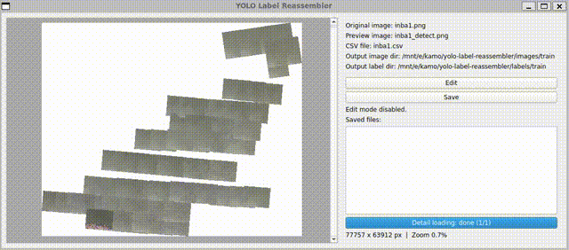
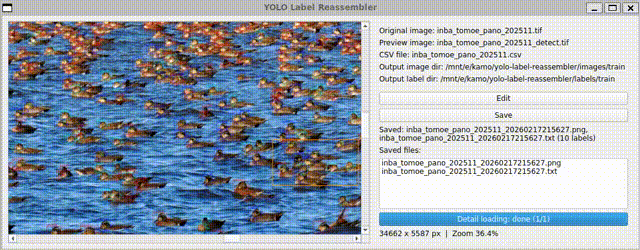
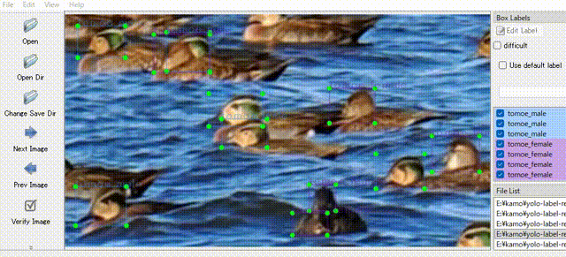
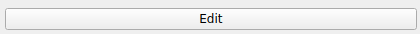
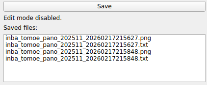
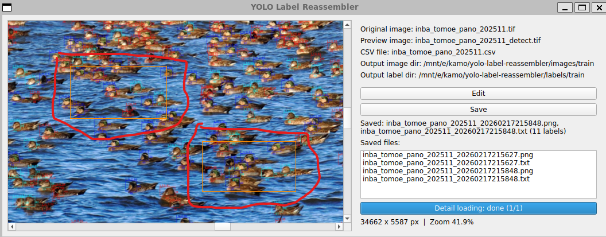

# YOLO Label Reassembler

Sliced Yolo Detectで検出を行った画像とデータから、YOLOモデルの再学習に使うデータを取り出すためのプログラムです。単に巨大な画像を見るためのツールとしても使えます。



<br>

# 用途

* 巨大な画像を比較的少ないメモリーで表示できます。70K x 70Kピクセルを超えるような画像は、Windows/Macの標準のアプリケーションでは表示できない場合がありますが、このプログラムなら大丈夫。多分。
* Sliced Yolo Detectで検出を行った結果、追加でYOLOモデルの再学習が必要だと判断した場合に使います。Sliced Yolo Detectの出力画像をマウスで囲って、その部分のデータをlabelImgで再編集可能なデータとして保存できます。

    
    <br>
    出力したファイルをlabelImgで編集する。<br>
    

<br>

## 動作環境と制限
* Windows 11/WSL2/Ubuntu/Python 3.9.13で開発・テストしました。macOSでも動作確認済み。libvipsライブラリを使っているので、それが動く環境ならだいたい動くはず。

<br>

## 既知の問題

巨大画像の場合、CLI実行からウィンドウが表示されるまでに時間がかかるほか、最初に画像を大きくズームした場合にも、高精細画像の読み込みに時間がかかります。最初のズーム後の読み込み中は、何も操作せずに待ってみてください。

一旦読み込まれれば、それ以降はほぼ待ち時間なく動作するはず。80K x 60Kピクセルの画像の場合にかかる時間は次の通りです。

||Win11/WSL2/Ubuntu<br>Intel Core Ultra 7 265|macOS<br>Apple M1|
|----|----|---|
|ウィンドウ表示まで|67 sec|48 sec|
|最初のズーム後load完了まで|58 sec|40 sec|

CPUの速度よりも、Disk I/O性能に大きく引きずられるようです。WSL2はオーバーヘッドが大きいのか。

<br>


<br>

# インストール方法
<a href="../README.md">トップページ参照</a>。または`yolo_label_reassembler.py`ファイルを自分の環境にコピーするだけでも良いです。以下のライブラリは追加でインストールする必要があります。

```
sudo apt install -y libvips
pip install PySide6 pyvips
```

<br>

# 使い方
1. 準備
    * sliced-yolo-detectで出力したラベリング済み画像のファイル名。以下、仮に`inba1_detect.png`とする。
    * sliced-yolo-detectで使用した元画像のファイル名。以下、仮に`inba1.png`とする。巨大画像を見るためだけに使う場合は不要。
    * sliced-yolo-detectで出力したCSVファイル名。以下、仮に`inba1.csv`とする。sliced-yolo-detect実行時に`--csv inba1.csv`と指定すると出力される。巨大画像を見るためだけに使う場合は不要。
    * (Optional) labelImgの画像フォルダへのパス。以下、仮に`/mnt/e/ylr/images/train`とする。指定しなければカレントディレクトリへ保存される。
    * (Optional) labelImgのラベルフォルダへのパス。以下、仮に`/mnt/e/ylr/labels/train`とする。指定しなければカレントディレクトリへ保存される。


2. 実行方法

    大きな画像を表示させたいだけなら`--in_yolo`オプションにそのファイル名を指定するだけで良いです。
    ```
    $ cd yolo-label-reassembler
    $ python yolo_label_reassembler.py --in_yolo inba1_detect.png
    ```

    labelImg用の学習データを保存したい場合は、三つのファイル（ラベリング済み画像、元画像、CSV）を指定する必要があります。
    ```
    $ cd yolo-label-reassembler
    $ python yolo_label_reassembler.py --in_yolo inba1_detect.png --in_orig inba1.png --in_csv inba1.csv --out_dir_images /mnt/e/ylr/images/train --out_dir_labels /mnt/e/ylr/labels/train
    ```

    巨大な画像の場合、ウィンドウが表示されるまでに時間がかかります。70k x 70kピクセル程度なら数分間待ってみてください。ウィンドウ表示後、最初に大きくズームインした直後も、読み込みに時間がかかります。そこでも何もせず数分程度待てば、それ以降はスムーズに動作するはずです。

3. labelImg用のデータを保存する方法

    * 上の手順で表示されたウィンドウで、元画像の保存したい場所を表示させてください。
    *  右上の`Edit`ボタンを押すと編集モードになります。`Exit Edit`を押すと、編集モードを抜けます。<br>
                    
    * 画像内で、保存したい部分をマウスで囲ってください。
    * `Save`ボタンを押すと、その部分の画像と、YOLOラベルファイルが保存されます。保存が完了すると、ファイル名が右側の`Saved files:`以下のリストに表示されます。保存先は、指定がなければカレントディレクトリ。`--out_dir_images`と`--out_dir_labels`の指定があれば、そちらになります。<br>
                    
    * 保存が完了した時点で、赤い枠は、オレンジ色に変更されます。<br>
            
    * 他の範囲を保存したい場合は、再度`Edit`ボタンを押して上の操作を繰り返してください。何度でも保存できます。毎回新しいファイル名になります。
